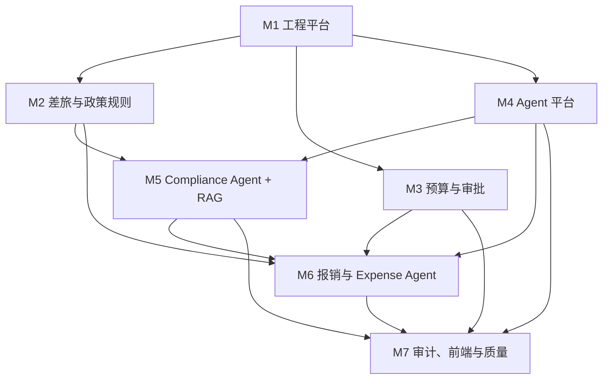

# TravelGuard 整体实施路线图与依赖关系

## 1. 模块划分

| 编号 | 模块 | 主要交付物 |
|---|---|---|
| M1 | 工程平台 | 项目骨架、配置、鉴权、数据库、迁移、Docker、CI、公共 API 能力 |
| M2 | 差旅与政策规则 | 差旅申请、行程、政策版本、Rule Gate、结构化政策规则 |
| M3 | 预算与审批 | 预算账本、预占/释放/结算、审批、Outbox、幂等与并发控制 |
| M4 | Agent 平台 | Orchestrator、Tool Registry、LLM Factory、Checkpointer、Trace、HITL |
| M5 | Compliance Agent 与 RAG | 文档解析、Hybrid Retrieval、政策证据、合规 Agent、评估集 |
| M6 | 报销与 Expense Agent | 票据、OCR/验真、三单匹配、重复检测、费用审核 Agent |
| M7 | 审计、前端与质量 | Audit Agent、演示界面、E2E、评估报告与回归门禁 |

## 2. 依赖图

图中的箭头表示“后者不能基于未合并实现开始集成”。成员可以在前置模块未完成时编写自己的测试数据、接口草案、页面 Mock 或评估样本，但不得猜测或复制前置模块的实现。

## 3. 分阶段交付

### Phase 0：工程地基

**并行工作**：M1 实现工程平台；M2 至 M7 在各自任务包中确认 Schema、测试场景和契约草案。

**合并门槛**：`main` 能启动 API 健康检查；迁移可升级/回滚；Python 3.11 依赖可解析；CI 至少运行格式、类型和测试命令。

### Phase 1：Agent-First 差旅合规闭环

**核心链路**：`TravelRequest → Rule Gate → 直接决策或 Compliance Agent → 人工审批 → Trace`。

**并行边界**：M2 实现 Rule Gate；M3 提供单笔预算预占和单一审批节点；M4 提供 Agent 平台；M5 在已确认的 Tool Schema 上实现 RAG 与 Compliance Agent；M7 实现申请、结果、人工审批和 Trace 页面及 E2E。

**合并门槛**：明确合规和明确拒绝的案件不调用 LLM；语义例外才进入 Agent；模型失败时保留规则结果并进入人工处理；四条路径均有可观察演示和测试。

### Phase 2：企业控制层加固

**核心工作**：M3 完整预算追加账本、并发一致性和多级审批；M2 完整政策发布与规则冲突检查；M4/M5 增加 Prompt、模型、规则、检索版本回放和影子评估；M1 增强权限与可观测性。

**合并门槛**：预算在重试和并发下不会重复结算；权限、审批与例外全程审计；模型变更可与固定基线比较。

### Phase 3：报销与 Expense Review Agent

**核心工作**：M6 完成安全上传、OCR/验真 Adapter、三单匹配、重复检测和 Expense Agent；M3 提供结算与差额释放；M7 完成财务页面与报销 E2E。

**合并门槛**：验真失败、金额不一致、重复票据和高风险结果不能自动通过；结算不重复记账。

### Phase 4：审计与管理看板

**核心工作**：M7 完成审计批次、风险特征、Audit Agent、人工确认、看板与报告；M1/M3/M4/M5/M6 提供只读事实、审计事件和 Trace 引用。

**合并门槛**：每项正式审计发现都能关联业务对象、检测方法、证据和人工确认。

### Phase 5：生产加固

**核心工作**：全员修复各自模块在压测、故障演练、安全扫描和回归评估中暴露的问题。

**合并门槛**：关键故障有 Runbook；外部模型或 Provider 不可用时预算、审批和资金链路仍安全。

## 4. 先后合并顺序

1. M1 的工程基础 PR。
2. M2、M3、M4 的公共 Schema/接口 PR；这三个 PR 必须先审接口，后并行实现。
3. M2 Rule Gate、M3 最小预算/审批、M4 Agent 平台的实现 PR。
4. M5 Compliance/RAG 集成 PR。
5. M7 的 Phase 1 页面和 E2E PR。
6. M3/M4/M5 的 Phase 2 加固 PR。
7. M6 的 Phase 3 报销 PR，再由 M7 补齐报销 E2E。
8. M7 的 Phase 4 审计 PR。

任何 PR 的依赖尚未合并时，必须标记为 Draft，不得以临时复制代码、模拟生产服务或跨模块修改来绕过依赖。
