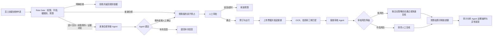
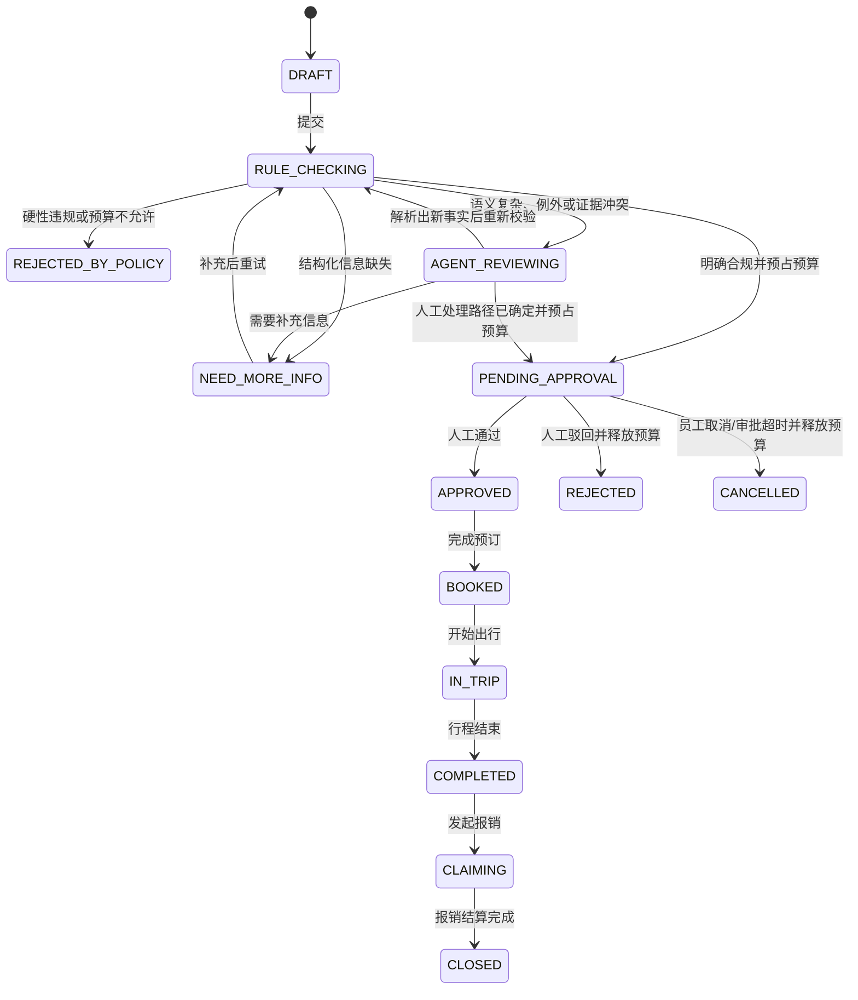
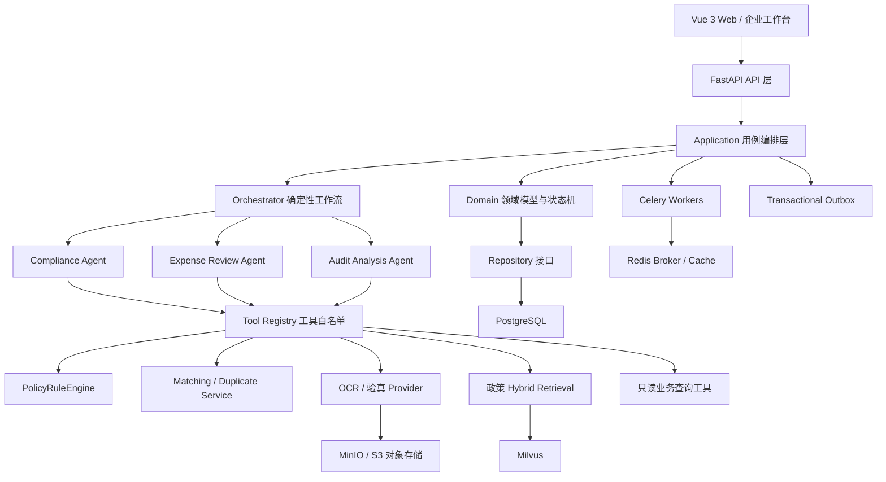

# TravelGuard AI 企业差旅合规与费用管控系统实现方案

> 文档定位：用于指导系统设计、研发拆分、测试验收和面试讲解。  
> 当前内容为目标方案与验收标准，不代表指标已经在生产环境达成。  
> 设计原则：业务正确性 > Agent 可控性 > 权限与数据安全 > 可评估性 > 可维护性 > 界面效果。

## 1. 项目定位

TravelGuard AI 面向有差旅管理需求的中大型企业，为员工、部门负责人、财务、预算负责人和审计人员提供覆盖“差旅申请—审批—预订—出行—报销—预算结算—事后审计”的闭环系统。

系统不是让大模型直接决定是否报销，而是采用以下职责划分：

- **确定性系统负责做决定**：金额计算、规则命中、预算占用、状态流转、权限校验和审批动作由领域服务及数据库事务保证。
- **Rule Gate 优先分流**：字段、权限、硬性政策和预算等可确定问题由后端直接处理；只有语义模糊、政策例外、复杂行程或证据冲突才进入 Agent 路径。
- **Agent 负责处理复杂信息**：理解自然语言行程、检索政策依据、分析非结构化票据、解释异常、生成审核意见和审计报告。
- **人工负责高风险确认**：超预算、政策例外、票据存疑、高金额报销和低置信度结果进入 Human-in-the-Loop 审批。

推荐形态为 **1 个 Orchestrator + 3 个业务 Agent + 5 类确定性服务/工具**：

1. 差旅合规审查 Agent
2. 报销审核 Agent
3. 审计分析 Agent
4. Orchestrator 统一编排器（不是独立业务决策 Agent）
5. 政策规则、预算、票据、审批、三单匹配等确定性领域服务

该划分比“所有模块都做成 Agent”更容易保证资金安全，也更符合真实企业软件的设计方式。

## 2. 目标用户与权限

| 角色 | 主要操作 | 数据范围 |
|---|---|---|
| 员工 | 提交差旅申请、上传票据、发起报销、查看进度 | 本人数据 |
| 部门负责人 | 审批本部门差旅和政策例外 | 所负责部门 |
| 财务人员 | 审核报销、处理票据异常、执行付款前复核 | 授权法人或部门 |
| 预算负责人 | 配置预算、查看占用和执行情况、处理超预算申请 | 授权预算中心 |
| 审计人员 | 查看审计样本、异常链路和证据、生成审计结论 | 授权审计范围 |
| 差旅管理员 | 维护政策、城市分级、费用标准和审批流程 | 所属租户 |
| 系统管理员 | 租户、组织、角色、Provider 配置和系统监控 | 管理范围，不默认读取票据正文 |

权限采用 `RBAC + 数据范围 ABAC`：角色决定能做什么，`tenant_id`、组织树、法人、部门和预算中心决定能看哪些数据。所有查询都必须携带租户条件，不能只依赖前端隐藏按钮。

## 3. 核心业务对象

### 3.1 差旅政策

政策不是一篇文档，而是两种数据的组合：

- **结构化规则**：员工职级、城市等级、交通工具、舱位、住宿上限、餐补、出行天数、提前预订天数、跨境限制、例外审批人等，保存在 PostgreSQL 并由规则引擎执行。
- **非结构化政策文档**：制度说明、FAQ、例外解释和外部法规，原文保存在对象存储，切块后写入 Milvus，用于检索依据和生成解释。

每一条政策都必须有 `policy_version`、生效时间、失效时间、适用组织和发布状态。审核时按“业务发生日”选择版本，历史单据始终保留当时使用的政策版本，避免政策更新后历史结论漂移。

### 3.2 预算

预算采用追加式流水账，不允许直接修改余额：

- `ALLOCATE`：下达预算
- `RESERVE`：差旅申请进入审批时预占预计金额
- `RELEASE`：驳回、取消、超时或实际金额低于预占时释放
- `SETTLE`：报销通过后把实际金额结转为已用
- `ADJUST`：授权人员进行有审计记录的预算调整

核心不变量：

```text
available_amount = allocated_amount - reserved_amount - spent_amount
available_amount >= 0（除非显式启用超预算并完成升级审批）
```

所有金额使用 `Decimal` / `NUMERIC(18, 2)`，禁止使用浮点数。

### 3.3 单据关联

系统围绕一条业务链关联以下对象：

```text
差旅申请 TravelRequest
  └─ 审批 ApprovalTask
      └─ 预算预占 BudgetReservation
          └─ 预订 Booking
              └─ 报销单 ExpenseClaim
                  ├─ 费用明细 ExpenseItem
                  ├─ 发票 Invoice
                  └─ 预算结算 BudgetSettlement
```

报销审核的核心是“申请—预订—票据/消费”三单匹配，而不是只看发票真假。

## 4. 端到端业务流程

### 4.1 总体闭环



### 4.2 差旅申请阶段

1. 员工填写出发地、目的地、日期、事由、同行人和预计费用。
2. API 完成身份、字段、日期范围和权限校验，创建 `DRAFT` 申请。
3. 员工提交后，应用服务在数据库事务内创建 `RULE_CHECKING` 任务，由 Rule Gate 依次执行字段完整性、权限、状态、硬性政策规则和预算可用性校验。
4. 对字段和事实均完整、规则结论明确的申请，Rule Gate 直接拒绝或进入预算预占与审批；此路径不依赖 LLM，也不创建阻塞业务的 `agent_run`。
5. 仅当出现自然语言行程、政策例外理由、复杂多段行程、证据冲突或无法安全自动判断的情况，Rule Gate 才创建 `agent_run`，在事务外调用合规 Agent。
6. Agent 只使用经过 Rule Gate 固化的事实快照，输出政策证据、语义分析、风险说明和建议审批路径；其结论不能覆盖硬规则或直接推进业务状态。
7. 若 Agent 需要补充信息，申请进入 `NEED_MORE_INFO`；补充后的结构化事实必须重新进入 Rule Gate。若 Agent 或模型不可用，则保留已有规则结论并转人工，而不允许猜测。
8. 对确定合规或经人工确认可继续的申请，预算服务在单个数据库事务内检查可用额度并写入 `RESERVE` 流水，同时创建审批任务。
9. 人工审批通过后进入 `APPROVED`；驳回、取消或审批超时均通过幂等命令释放预算。普通合规申请的政策解释可由 Agent 异步生成，但不得阻塞上述状态变化。

### 4.3 报销阶段

1. 员工选择已完成的差旅申请，填写费用明细并上传发票、行程单和支付凭证。
2. 文件先进入隔离对象存储区，执行格式检查、大小限制、恶意文件扫描和哈希去重。
3. Celery 异步执行 OCR 与发票验真，Provider 返回结果统一映射为内部 `InvoiceRecognitionResult`，原厂商字段不进入领域层。
4. MatchingService 对差旅申请、预订记录和报销明细进行三单匹配：人员、城市、日期、商户、费用类型、金额和币种。
5. DuplicateService 使用发票代码、号码、金额、日期、销售方税号、文件哈希等字段检查本次及历史重复报销。
6. 报销审核 Agent 汇总结构化事实，检索对应政策，识别个人消费、日期偏移、金额拆分、疑似超标等需要语义判断的情况。
7. Agent 只输出 `PASS_RECOMMENDED`、`REVIEW_REQUIRED` 或 `REJECT_RECOMMENDED` 建议，以及逐项证据；不直接修改报销状态或预算。
8. 应用服务依据企业自动化策略决定是否允许低风险自动通过。高金额、验真失败、低置信度、超预算和政策例外必须进入财务人工复核。
9. 报销最终通过后，BudgetService 在事务中执行 `SETTLE`：把实际合规金额计入已用，并释放预占差额。实际金额超过预占时必须重新检查额度并按阈值触发追加审批。
10. Outbox 记录付款和通知事件，由异步 Worker 可靠投递；通知失败不回滚已经完成的业务事务。

### 4.4 事后审计阶段

1. 定时任务按金额、异常标签、人工改判、政策例外、频繁出差、供应商集中度等规则选取审计样本。
2. 审计分析 Agent 获取脱敏后的业务快照和证据引用，分析跨单据、跨人员或跨周期的异常模式。
3. 系统生成审计发现，包括风险描述、涉及单据、规则或统计依据、建议动作和风险分级。
4. 审计人员确认、驳回或修改结论。只有人工确认后的发现才能进入正式审计报告或后续追偿流程。
5. 人工处理结果回流固定评估集，用于分析 Agent 的误报、漏报和规则盲区，不直接在线自学习。

## 5. 状态机设计

### 5.1 差旅申请状态



任何状态变化都由应用服务调用领域方法完成，并校验 `expected_version`。Agent 不能直接更新状态字段。

### 5.2 报销单状态

```text
DRAFT
  → PROCESSING_DOCUMENTS
  → AGENT_REVIEWING
  → PENDING_FINANCE_REVIEW / APPROVED
  → SETTLING
  → PAID / REJECTED / CANCELLED
```

`PROCESSING_DOCUMENTS` 和 `AGENT_REVIEWING` 必须支持失败重试与断点恢复；`SETTLING` 使用幂等键防止重复记账。

## 6. 系统架构



### 6.1 分层职责

| 层级 | 职责 | 禁止事项 |
|---|---|---|
| API | 鉴权、Schema 校验、幂等键、统一响应 | 不写复杂业务规则 |
| Application | 用例编排、事务边界、调用 Agent 与领域服务 | 不拼 SQL，不持有外部调用事务 |
| Domain | 实体、值对象、状态机、政策和预算不变量 | 不依赖 FastAPI、ORM、LangGraph、Redis、Milvus |
| Agents | 信息理解、受控工具调用、证据组织、建议生成 | 不直接访问 ORM，不直接改金额和业务状态 |
| Adapters | PostgreSQL、LLM、OCR、Milvus、通知等实现 | 不把厂商 Schema 泄漏到业务层 |
| Infrastructure | 配置、日志、Trace、队列、缓存和部署 | 不承载业务决策 |

## 7. Agent 设计

### 7.1 Orchestrator 统一编排器

Orchestrator 是确定性工作流入口，不依赖大模型自由决定业务状态。它根据明确的业务事件路由：

- `TRAVEL_REQUEST_SUBMITTED` → Rule Gate
- `RULE_GATE_REQUIRES_AGENT` → Compliance Agent
- `RULE_GATE_DIRECT_DECISION` → 预算预占与审批流程，不调用 Agent
- `EXPENSE_DOCUMENTS_READY` → Expense Review Agent
- `AUDIT_BATCH_CREATED` → Audit Analysis Agent
- Agent 返回 `NEED_HUMAN` → 创建人工任务并暂停 LangGraph
- 人工处理完成 → 使用同一个 `thread_id` 恢复执行

关键设计：

- Agent 图懒加载并缓存，降低启动开销。
- `thread_id = tenant_id + business_type + business_id + run_version`，防止租户和任务串线。
- 输入输出统一使用 Pydantic Schema，禁止任意字典在模块间漂移。
- 每个节点有超时、最大重试次数和可观测事件。
- 使用 PostgreSQL 持久化 Checkpointer；`MemorySaver` 只用于本地测试。
- 连续调用相同工具或超过最大步数时触发循环保护。
- Rule Gate 的结果是 Agent 调用的前置条件；Orchestrator 不得为了生成解释而把明确规则案件改走阻塞 Agent 路径。

### 7.2 差旅合规审查 Agent

#### 作用

仅处理 Rule Gate 无法安全自动裁决的差旅申请：政策例外理由、自然语言行程、复杂多段行程、证据冲突和需要补充语义信息的案件。明确的字段错误、硬性违规、预算不足和普通合规申请不以调用本 Agent 为前提。

#### 输入

```python
class ComplianceAgentInput(BaseModel):
    tenant_id: UUID
    travel_request_id: UUID
    applicant_id: UUID
    policy_effective_date: date
    run_id: UUID
```

Agent 只接收业务对象 ID，不在 State 中保存整份文件或大段原文。节点通过只读工具获取所需快照。

#### State 核心字段

```python
class ComplianceState(TypedDict):
    tenant_id: str
    travel_request_id: str
    run_id: str
    request_snapshot: dict[str, object]
    employee_snapshot: dict[str, object]
    policy_version_id: str | None
    deterministic_violations: list[dict[str, object]]
    retrieved_evidence: list[dict[str, object]]
    risk_level: str | None
    recommendation: dict[str, object] | None
    confidence: float | None
    needs_human: bool
    fallback_used: bool
    errors: list[dict[str, str]]
```

生产代码中应进一步把 `dict[str, object]` 替换为明确 Pydantic 模型，确保 State 可 JSON 序列化。

#### LangGraph 节点

```text
load_rule_gate_snapshot
  → normalize_semantic_context
  → retrieve_policy_evidence
  → analyze_semantic_exception
  → build_human_review_context
  → build_review_result
  → validate_structured_output
  → persist_agent_result
```

节点说明：

| 节点 | 作用 | 是否调用 LLM |
|---|---|---|
| load_rule_gate_snapshot | 获取已校验的申请、员工、预算、规则与政策版本快照 | 否 |
| normalize_semantic_context | 从事由、备注或例外说明提取待复核语义信息 | 必要时 |
| retrieve_policy_evidence | Hybrid Search + Rerank 获取原文依据 | 否 |
| analyze_semantic_exception | 判断自然语言例外理由与政策条款的关系 | 是 |
| build_human_review_context | 组织规则结论、证据和待人工确认项 | 否 |
| build_review_result | 生成清晰的审核建议和逐项解释 | 是 |
| validate_structured_output | Schema、证据引用和数值一致性校验 | 否 |
| persist_agent_result | 通过应用端口保存 Agent 运行结果 | 否 |

#### 输出

```python
class ComplianceReviewResult(BaseModel):
    policy_version_id: UUID
    decision: Literal["PASS_RECOMMENDED", "EXCEPTION_APPROVAL", "REJECT_RECOMMENDED", "NEED_MORE_INFO"]
    risk_level: Literal["LOW", "MEDIUM", "HIGH", "CRITICAL"]
    violations: list[PolicyViolation]
    evidence: list[PolicyEvidence]
    approval_route_code: str
    confidence: float
    fallback_used: bool
```

输出是审核建议，不是最终审批动作。

#### 降级策略

1. Rule Gate 始终先执行；它的明确拒绝和普通合规结果不依赖本 Agent。
2. 进入 Agent 路径后，首选 LLM 结构化输出；超时或限流后切备用模型，仅重试可安全重试的调用。
3. 两个模型均失败时保留确定性规则结果，标记 `fallback_used=true` 并进入人工复核。
4. 政策证据不足时不允许模型补写条款，必须返回 `EVIDENCE_INSUFFICIENT`。

### 7.3 报销审核 Agent

#### 作用

对已经完成 OCR、验真和三单匹配的报销材料进行综合审核，识别超标、个人消费、重复报销和跨单据异常，并给出证据化建议。

#### 为什么 OCR 不单独作为 Agent

OCR 和发票验真是输入输出明确的 Provider 能力，不需要自主规划。将其注册为受控工具或异步任务，可以独立切换供应商、做超时重试和契约测试，也不会把厂商结果误当作最终业务结论。

#### LangGraph 节点

```text
load_claim_snapshot
  → wait_document_jobs
  → validate_invoice_results
  → run_three_way_matching
  → run_duplicate_detection
  → execute_expense_rules
  → retrieve_policy_evidence
  → analyze_semantic_items
  → score_claim_risk
  → route_human_review
  → persist_review_result
```

关键判断：

- 申请人与发票人员/购方是否一致。
- 出行日期与住宿、交通票据日期是否匹配，允许配置前后偏移。
- 目的地、酒店城市、出发到达城市是否一致。
- 预订金额、发票金额、报销金额是否一致，差额原因是否合理。
- 是否存在超标准住宿、舱位升级、个人延住、迷你吧、洗衣等不可报费用。
- 发票代码与号码、销售方税号、金额、日期、文件哈希是否在历史数据中重复。
- 发票验真失败、验真信息与 OCR 信息冲突时强制人工复核。
- 外币按业务发生日或公司配置汇率折算，并保留汇率来源和版本。

#### 输出

```python
class ExpenseReviewResult(BaseModel):
    decision: Literal["PASS_RECOMMENDED", "REVIEW_REQUIRED", "REJECT_RECOMMENDED"]
    risk_score: int
    risk_level: Literal["LOW", "MEDIUM", "HIGH", "CRITICAL"]
    approved_amount_suggestion: Decimal
    rejected_amount_suggestion: Decimal
    item_findings: list[ExpenseFinding]
    invoice_findings: list[InvoiceFinding]
    evidence: list[PolicyEvidence]
    confidence: float
    needs_human: bool
```

LLM 给出的金额必须由后处理器重新逐项求和；任何不相等都视为结构化输出无效，不能进入结算。

### 7.4 审计分析 Agent

#### 作用

在日常逐单审核之外，发现跨人员、跨部门、跨供应商和跨时间窗口的异常模式，并协助审计人员形成报告。

#### LangGraph 节点

```text
load_audit_batch
  → build_risk_features
  → execute_sampling_rules
  → detect_cross_claim_patterns
  → retrieve_business_evidence
  → generate_findings
  → human_auditor_review [interrupt]
  → finalize_audit_report
```

#### 异常模式示例

- 同一人员连续多次贴近住宿上限报销。
- 多人使用相同发票或高度相似的票据图片。
- 同一供应商在特定部门的消费异常集中。
- 经常拆单绕过审批阈值。
- 同一路线的机票价格长期明显高于同时间段基线。
- 人工审批人对特定人员的例外通过率显著偏高。

第一阶段使用规则和统计阈值即可；数据量充足后可增加 Isolation Forest 等无监督模型。LLM 主要负责关联证据和生成可读报告，不能凭空给人员定性为舞弊。

#### 输出

审计结果必须包含 `finding_type`、`risk_level`、`related_entity_ids`、`evidence_refs`、`detection_method`、`recommended_action` 和人工确认状态。正式报告只纳入人工确认项。

## 8. 确定性领域服务与工具

| 服务/工具 | 核心职责 | 一致性要求 |
|---|---|---|
| PolicyRuleEngine | 版本化规则执行、违规项与阈值计算 | 同样输入必须得到同样结果 |
| BudgetService | 预算预占、释放、结算、调整和余额查询 | 事务、行锁/乐观锁、幂等、追加流水 |
| InvoiceGateway | OCR、发票验真、Provider 适配 | 超时、重试、熔断、请求去重、结果留痕 |
| MatchingService | 申请、预订、报销和发票三单匹配 | 规则版本化、金额使用 Decimal |
| ApprovalService | 审批路由、加签、驳回、超时和恢复 | 状态机、权限校验、动作追加写入 |

### 8.1 Tool Registry

每个工具注册以下元数据：

- 工具名、版本和清晰描述
- Pydantic 输入输出 Schema
- 允许调用的 Agent
- 是否只读、是否高风险、是否需要人工确认
- 超时、重试和熔断策略
- 数据脱敏策略
- 幂等能力和审计字段

Agent 只能调用白名单工具，不提供任意 SQL、Shell、Python 或开放网络访问能力。

### 8.2 规则引擎方案

第一阶段不引入复杂 Drools，可在 PostgreSQL 保存版本化 JSON 规则，领域层解析为条件树：

```json
{
  "rule_code": "HOTEL_LIMIT_L3_TIER1",
  "priority": 100,
  "conditions": [
    {"field": "employee_level", "operator": "eq", "value": "L3"},
    {"field": "city_tier", "operator": "eq", "value": "TIER_1"}
  ],
  "action": {
    "type": "AMOUNT_LIMIT",
    "field": "hotel_daily_amount",
    "limit": "600.00",
    "currency": "CNY",
    "exception_route": "DEPT_MANAGER_AND_FINANCE"
  }
}
```

规则发布时进行字段白名单、操作符、循环引用和冲突检查；发布后不可原地修改，只能创建新版本。

## 9. RAG 与政策知识库

### 9.1 索引流程

```text
政策发布
  → Outbox 产生 POLICY_PUBLISHED
  → Celery 解析 PDF/Word/Markdown
  → 按标题和条款语义分块
  → BGE-M3 生成 Dense + Sparse 向量
  → 写入 Milvus
  → 更新 policy_index_status
```

Chunk 元数据至少包含：`tenant_id`、`policy_id`、`policy_version_id`、`document_id`、`section_path`、`page_no`、`effective_from`、`effective_to` 和内容哈希。

### 9.2 检索流程

1. 使用租户、政策版本和业务日期做硬过滤。
2. Dense 与 Sparse/BM25 混合召回 Top 20。
3. 使用 BGE-Reranker 精排到 Top 5。
4. 对相邻条款做上下文扩展，但限制总 Token。
5. 返回结构化证据，答案引用精确到政策版本、章节和页码。

规则数据库是金额和阈值的权威来源；Milvus 是解释性文档检索来源。两者冲突时停止自动审核并通知政策管理员，不能由 LLM 自行选择。

## 10. 数据模型设计

核心表建议如下：

| 表 | 关键字段/约束 |
|---|---|
| tenants | `id`, `name`, `status` |
| users | `id`, `tenant_id`, `employee_no`, `department_id`, `level`, 唯一约束 |
| departments | 组织树、预算中心映射 |
| travel_requests | 申请快照、状态、`policy_version_id`, `version` |
| travel_itineraries | 城市、日期、交通方式、预计金额 |
| bookings | 外部预订单号、金额、供应商、状态 |
| policies | 政策主实体、适用范围 |
| policy_versions | 版本、生效区间、发布状态、内容哈希 |
| policy_rules | 版本化 JSON 规则、优先级 |
| budget_accounts | 年度、部门、科目、币种、锁版本 |
| budget_ledger | 追加式流水、业务引用、幂等键、发生前后余额 |
| expense_claims | 报销总额、建议金额、最终金额、状态、版本 |
| expense_items | 类型、日期、商户、币种、原币和本币金额 |
| invoices | OCR 字段、验真状态、票据指纹、文件引用 |
| invoice_provider_calls | 请求哈希、Provider、状态、脱敏响应引用、耗时 |
| approval_tasks | 业务类型、审批人、状态、到期时间 |
| approval_actions | 追加式动作、意见、操作者、时间 |
| agent_runs | Agent 类型、版本、模型、Prompt 版本、状态、耗时 |
| tool_calls | 工具版本、脱敏入参出参、错误码、耗时 |
| audit_findings | 风险、证据、人工结论和处置状态 |
| outbox_events | 事件类型、聚合根、载荷、投递状态、重试次数 |
| idempotency_records | 租户、API、幂等键、请求哈希、响应快照 |

通用要求：

- 主键使用 UUID。
- 所有业务表带 `tenant_id`、`created_at`、`updated_at`；关键表带 `created_by` 和 `version`。
- 预算流水、审批动作、Agent 运行记录和审计日志只追加，不物理删除。
- 有引用的政策和业务单据使用逻辑归档。
- 发票敏感字段分级存储和展示，文件只通过短时签名 URL 访问。

## 11. API 设计

统一返回：

```json
{
  "code": "OK",
  "data": {},
  "message": "success",
  "request_id": "req_xxx"
}
```

写接口必须支持 `Idempotency-Key`。核心 API：

```text
POST   /api/v1/travel-requests
POST   /api/v1/travel-requests/{id}/submit
GET    /api/v1/travel-requests/{id}/compliance-result
POST   /api/v1/travel-requests/{id}/cancel

GET    /api/v1/approval-tasks
POST   /api/v1/approval-tasks/{id}/approve
POST   /api/v1/approval-tasks/{id}/reject

POST   /api/v1/expense-claims
POST   /api/v1/expense-claims/{id}/documents
POST   /api/v1/expense-claims/{id}/submit
GET    /api/v1/expense-claims/{id}/review-result

GET    /api/v1/budgets/{id}/summary
GET    /api/v1/budgets/{id}/ledger

POST   /api/v1/audit-batches
GET    /api/v1/audit-batches/{id}/findings
POST   /api/v1/audit-findings/{id}/confirm

GET    /api/v1/jobs/{job_id}/events    # SSE
```

审批接口除了幂等键，还需要 `expected_version`，避免两位审批人同时操作产生覆盖。

## 12. 异步任务与事件一致性

适合异步执行的任务：

- OCR 和发票验真
- 政策文档解析、Embedding 和索引更新
- 大批量审计分析
- 通知投递和失败重试
- 日度预算汇总与过期预占释放

业务表和 Outbox 事件在同一 PostgreSQL 事务中提交。Worker 采用至少一次投递，因此消费者必须依据 `event_id` 幂等。Redis 用作 Celery Broker、短期缓存和 SSE 分发，不作为业务状态的唯一事实来源。

外部 LLM、OCR、验真和通知调用不得持有数据库事务。推荐模式：

```text
事务 1：保存业务快照与任务状态 → 提交
事务外：调用外部 Provider
事务 2：校验业务版本未变化 → 保存结果与推进状态 → 提交
```

## 13. 技术栈

| 类别 | 推荐技术 | 用途 |
|---|---|---|
| 后端语言 | Python 3.11 | 异步服务、Agent 和数据处理 |
| API | FastAPI、Pydantic v2 | REST/SSE、Schema、依赖注入 |
| Agent | LangGraph、LangChain | 显式状态机、interrupt、Tool Calling、结构化输出 |
| 异步任务 | Celery 5、Redis 7 | OCR、索引、审计和通知任务 |
| 业务数据库 | PostgreSQL 15+ | 事务、JSONB、预算流水和审计数据 |
| ORM/迁移 | SQLAlchemy 2.0 Async、Alembic | Repository 实现和版本化迁移 |
| 向量检索 | Milvus 2.3+ | 政策 Dense/Sparse Hybrid Search |
| Embedding | BGE-M3 | 中文政策 Dense + Sparse 表示 |
| Reranker | BGE-Reranker | 政策候选精排 |
| LLM | OpenAI 兼容 API / 国产模型 | 结构化理解、解释和报告生成，通过 LLM Factory 适配 |
| 文档/票据 | PaddleOCR 或商业 OCR/验真 API | 票据识别，业务仅依赖内部接口 |
| 对象存储 | MinIO / S3 | 发票、行程单、政策原文 |
| 前端 | Vue 3、TypeScript、Vite、Element Plus、Pinia | 员工、审批、财务和审计工作台 |
| 可观测性 | OpenTelemetry、Prometheus、Grafana、Loki/ELK、Langfuse 可选 | 日志、指标、Trace 和 LLM 评估追踪 |
| 测试 | Pytest、pytest-asyncio、HTTPX、Hypothesis、Testcontainers、Vitest | 单元、集成、并发、契约和前端测试 |
| 工程工具 | uv、Ruff、mypy、pre-commit、Docker Compose、CI | 依赖、质量门禁和环境一致性 |

首期使用 Docker Compose 部署即可；只有在租户数量、Worker 并发或高可用需求明确后再引入 Kubernetes，避免为了“技术栈丰富”增加无效复杂度。

## 14. 代码目录建议

```text
travelguard-ai/
├─ src/
│  ├─ api/
│  │  ├─ v1/
│  │  ├─ schemas/
│  │  └─ middleware/
│  ├─ application/
│  │  ├─ travel/
│  │  ├─ expense/
│  │  ├─ approval/
│  │  ├─ budget/
│  │  └─ audit/
│  ├─ domain/
│  │  ├─ travel/
│  │  ├─ policy/
│  │  ├─ expense/
│  │  ├─ budget/
│  │  └─ approval/
│  ├─ agents/
│  │  ├─ base/
│  │  │  ├─ tool_registry.py
│  │  │  ├─ guards.py
│  │  │  └─ schemas.py
│  │  ├─ compliance/
│  │  │  ├─ graph.py
│  │  │  ├─ state.py
│  │  │  ├─ nodes/
│  │  │  ├─ prompts/
│  │  │  └─ tools/
│  │  ├─ expense_review/
│  │  └─ audit_analysis/
│  ├─ orchestrator/
│  │  ├─ service.py
│  │  ├─ routing.py
│  │  └─ hitl.py
│  ├─ adapters/
│  │  ├─ persistence/
│  │  ├─ llm/
│  │  ├─ invoice/
│  │  ├─ vectorstore/
│  │  ├─ storage/
│  │  └─ notification/
│  ├─ infrastructure/
│  │  ├─ db/
│  │  ├─ celery/
│  │  ├─ observability/
│  │  └─ security/
│  └─ main.py
├─ frontend/
├─ tests/
│  ├─ unit/
│  ├─ integration/
│  ├─ contract/
│  ├─ e2e/
│  └─ evaluations/
├─ scripts/
├─ docs/
├─ alembic/
├─ docker-compose.yml
├─ pyproject.toml
└─ .env.example
```

Agent 的 `graph.py` 只负责组图，节点拆到 `nodes/`，Prompt 按版本保存；单文件尽量不超过 400 行。

## 15. 工程化设计

### 15.1 幂等与并发

- 创建申请、提交报销、审批、预算预占和结算均接受幂等键。
- 幂等记录保存请求哈希；相同键但请求体不同返回冲突。
- 预算账户使用数据库行锁或带 `version` 的条件更新。
- 审批和状态推进使用乐观锁，冲突返回 `409 BUSINESS_VERSION_CONFLICT`。
- Provider 请求使用业务 ID + 文件哈希生成请求键，避免网络重试造成重复扣费。

### 15.2 错误体系

错误分为：

- `ValidationError`：用户输入错误，不重试。
- `PermissionDenied`：权限或数据范围错误，不重试并记录安全审计。
- `BusinessRuleViolation`：预算不足、状态不允许等业务错误。
- `ProviderTimeout/RateLimit`：按指数退避和抖动有限重试。
- `AgentStructuredOutputError`：只允许一次格式修复，随后降级人工。
- `ConcurrencyConflict`：客户端刷新版本后重新操作。

日志记录内部错误详情，API 只返回安全错误码，不回传 Prompt、密钥、SQL 或 Provider 原始敏感响应。

Rule Gate 的明确合规和明确拒绝属于正常业务分支，而不是错误：它们不调用 Agent；如需政策解释，只能异步附加，且不得影响预算、审批或状态迁移。

### 15.3 LLM 可控性

- 温度低值，所有关键结果使用结构化输出。
- Prompt 包含角色边界、允许使用的事实、禁止推测项和输出 Schema。
- 模型只能使用工具返回的事实；所有政策结论必须绑定证据引用。
- Agent 是 Rule Gate 的受控增强层，不得接管字段校验、硬规则、预算计算、状态迁移或普通合规案件的同步决策。
- 最大节点数、最大工具调用次数和总 Token 预算均可配置。
- Prompt、模型、Embedding、Reranker 和规则均记录版本，支持结果重放。
- 高风险结论、低置信度和降级结果强制人工确认。
- Agent 输出在进入业务层前经过 Schema、金额、枚举、证据完整性和租户一致性校验。

### 15.4 安全与隐私

- 文件上传校验扩展名、MIME、大小和内容，进入隔离区后扫描。
- 姓名、证件号、手机号、银行卡和发票号码按需脱敏。
- 日志、Trace、评估样本和 Prompt 不保存无必要的原始个人数据。
- 对象存储使用私有 Bucket、服务端加密和短时签名 URL。
- Provider 按数据出境和企业合规要求选择，发送前做最小化字段裁剪。
- 数据保留期和删除策略按租户配置；审计流水按法规要求留存。
- 管理员操作、政策发布、预算调整和数据导出必须记录安全审计日志。

### 15.5 可观测性

统一关联字段：

```text
request_id → trace_id → business_id → agent_run_id → tool_call_id → outbox_event_id
```

核心指标：

- API P50/P95/P99 延迟、错误率、并发量
- Agent 成功率、降级率、平均节点数、循环拦截次数
- LLM 首 Token/总耗时、Token 使用量、结构化输出失败率
- OCR 成功率、验真超时率、Provider 熔断状态
- Celery 队列长度、任务等待时间、重试和死信数
- 预算预占冲突、结算失败、过期预占数量
- 人工复核率、人工改判率、自动通过率

## 16. 测试与评估

### 16.1 测试金字塔

| 层级 | 重点 |
|---|---|
| Domain 单元测试 | 政策规则、金额、状态机、预算不变量 |
| Property-based 测试 | 任意预占/释放/结算序列后账本恒等式成立，不能重复结算 |
| Agent 节点测试 | 固定输入、Mock 工具、结构化输出、分支和降级 |
| Rule Gate 路由测试 | 明确合规/拒绝不调用模型；语义复杂、例外和证据冲突才创建 Agent 任务 |
| Repository 集成测试 | PostgreSQL 事务、锁、唯一约束、Alembic 升降级 |
| Provider 契约测试 | OCR/LLM/验真 Adapter 对超时、错误码和字段变化的处理 |
| API 测试 | 鉴权、租户隔离、幂等、并发冲突和统一错误格式 |
| E2E 测试 | 申请到预算预占、报销到结算、驳回到释放的完整闭环 |
| 故障测试 | Provider 超时、Redis 短暂不可用、Worker 重启、消息重复投递 |

### 16.2 Agent 固定评估集

按业务场景构造脱敏或合成的金标数据：

- 正常差旅
- 酒店、舱位、补贴超标
- 政策版本切换边界日
- 多城市、多段行程和跨境差旅
- 允许例外与不允许例外
- 发票验真失败、OCR 字段冲突
- 重复发票和相似图片
- 个人延住、同行人混合消费
- 拆单绕过阈值
- Prompt Injection 和恶意票据文本

建议首期验收目标：

| 指标 | 目标 | 说明 |
|---|---:|---|
| 硬规则违规召回率 | ≥ 99% | 由规则引擎保证，关键规则不得依赖 LLM |
| 综合违规召回率 | ≥ 95% | Agent + 规则的总体效果 |
| 政策证据引用正确率 | ≥ 98% | 版本、条款与结论一致 |
| 重复报销识别召回率 | ≥ 95% | 在固定评估集上统计 |
| 结构化输出成功率 | ≥ 99% | 含一次格式修复后的比例 |
| 预算账本一致性 | 100% | 并发和重试下不得超扣、重复结算 |
| 高风险人工覆盖率 | 100% | 高风险不得自动通过 |
| Rule Gate 直决正确率 | 100% | 明确规则案件的状态和金额不依赖 LLM |
| Agent P95 耗时 | ≤ 8 秒 | 不包含需要长时间 OCR 的异步等待 |

以上是设计目标，必须用固定数据集真实测量后才能写入简历成果。不能把目标值当成已完成指标。

### 16.3 评估方法

- 确定性字段使用程序化指标，不使用 LLM-as-Judge 替代。
- 解释完整性、可读性可使用模型评审，但要抽样人工复核并校准一致性。
- 每次 Prompt、模型、规则或检索参数修改都运行回归集并保留版本对比。
- 线上监控人工改判率和误报原因，按周补充困难样本。
- 新版本先影子运行，再小流量灰度，不直接替换生产审核结果。

## 17. CI/CD 与部署

### 17.1 质量门禁

```text
后端：ruff check . && ruff format --check . && mypy src/ && pytest
前端：npm run lint && npm run typecheck && npm run test
迁移：alembic upgrade head + downgrade -1 + upgrade head
Agent：运行受影响 Agent 的固定评估集并生成对比报告
安全：依赖漏洞扫描、密钥扫描、镜像扫描
```

任何预算、审批或权限相关测试失败均阻断发布。Agent 指标低于基线也阻断发布，不能通过删除样本或放宽阈值解决。

### 17.2 部署单元

- `frontend`：静态资源或 Nginx
- `api`：FastAPI，多实例无状态部署
- `worker-ocr`：高 I/O Worker，独立并发和限流
- `worker-agent`：LLM/Embedding 任务
- `worker-audit`：低优先级批处理
- `scheduler`：Celery Beat，仅一个有效实例
- PostgreSQL、Redis、Milvus、MinIO
- Prometheus、Grafana、日志与 Trace 服务

数据库迁移使用独立一次性 Job，在 API 新版本启动前执行。应用支持优雅停机，避免 Worker 中断后任务永久丢失。

## 18. 分阶段实施计划

### Phase 0：工程地基

交付：

- Python/Node 工程、配置、统一日志和异常体系
- Docker Compose、PostgreSQL、Redis、Milvus、MinIO
- FastAPI 健康检查、鉴权骨架、统一响应和 `request_id`
- SQLAlchemy Async、Alembic、Repository 基类
- CI 质量门禁和测试骨架

验收：本地一条命令启动；迁移可升级回滚；租户鉴权和健康检查通过。

### Phase 1：Agent-First 差旅合规垂直切片

交付：

- 最小差旅申请与 `DRAFT → RULE_CHECKING → NEED_MORE_INFO / AGENT_REVIEWING / PENDING_APPROVAL / REJECTED_BY_POLICY / APPROVED` 状态机
- Rule Gate：字段、权限、硬性政策规则、单笔预算检查和 Agent 分流
- 最小政策版本与结构化规则、单笔预算预占/释放、单一人工审批节点
- Compliance Agent、Tool Registry、LLM Factory、持久化 Checkpointer 和三层降级
- Hybrid RAG、政策证据展示、完整 Trace、固定评估集与回归报告

验收：明确合规和明确拒绝申请不调用 LLM 仍能完成规则校验、预算预占/释放与审批；政策例外、复杂行程和证据冲突才进入 Compliance Agent，且结果可追溯到规则和政策原文；LLM 故障时保留规则结果并正确转人工。

### Phase 2：企业控制层与完整业务加固

交付：

- 完整预算追加式流水、`RESERVE / RELEASE / SETTLE` 与并发一致性控制
- 多级审批、超时、加签、例外审批、动作日志和 Transactional Outbox
- 政策发布、规则冲突检查、索引异步更新和历史版本回放
- 幂等、并发、权限数据范围、Prompt/模型/规则版本治理与影子评估

验收：不改变 Phase 1 Agent 输入输出契约的前提下，预算账本在并发与重试下保持一致；审批和例外路径全程可审计；模型、Prompt、规则或检索变更均可与固定基线回归比较。

### Phase 3：票据与报销审核

交付：

- 安全上传、对象存储、OCR/验真 Adapter
- 三单匹配、重复检测和费用规则
- Expense Review Agent、财务工作台和 HITL
- 实际金额结算和预占差额释放

验收：同一请求重复提交不重复 OCR、审批或结算；验真失败、高风险和金额不一致均不能自动通过。

### Phase 4：审计与管理看板

交付：

- 审计批次、抽样规则、跨单据特征
- Audit Analysis Agent 和人工确认
- 预算、合规、异常、人工改判看板
- 审计报告导出和数据权限控制

验收：每条审计发现都能定位到原业务对象、检测方法和证据；未确认结论不进入正式报告。

### Phase 5：生产加固

交付：

- 压测、容量规划、熔断、限流和故障演练
- 数据脱敏、保留期、密钥管理和安全扫描
- Agent 影子评估、灰度发布和回滚
- 告警、SLO、运行手册和灾备方案

验收：关键故障有可执行 Runbook；模型或 Provider 不可用时核心资金与审批链路仍安全。

## 19. 一个可完整讲述的业务案例

三级员工提交“上海到北京出差 3 天”，公司政策规定北京住宿标准为 600 元/晚，但员工预计 780 元/晚，并说明展会期间协议酒店满房。

1. Compliance Agent 根据员工职级、目的地和出行日期选择政策版本。
2. PolicyRuleEngine 确定每天超标 180 元，共超标 540 元；RAG 找到“展会期间可走例外审批”的政策原文。
3. Agent 输出 `EXCEPTION_APPROVAL`，引用具体条款并建议部门负责人和财务双重审批。
4. BudgetService 原子预占整笔预计费用，审批通过后员工出行。
5. 报销时员工上传 3 晚酒店发票，其中 1 晚属于个人延住。OCR 与验真正常，三单匹配发现日期比批准行程多 1 天。
6. Expense Review Agent 将个人延住标为不可报，并给出政策依据，建议报销 2 晚合规部分。
7. 财务确认后，BudgetService 结算实际合规金额并释放剩余预占。
8. 所有 Agent 运行、工具调用、政策版本、人工审批和预算流水形成完整审计链。

这个案例能够同时说明 RAG、规则引擎、LangGraph、HITL、异步 OCR、预算事务、幂等、审计追踪和 Agent 评估，不需要虚构复杂数据也能把项目讲通。

## 20. 面试讲解主线

建议按以下顺序介绍：

1. **业务痛点**：传统差旅审批依赖人工查制度，报销审核慢，预算占用不实时，事后审计覆盖率低。
2. **架构选择**：没有让大模型直接管钱，而是“确定性领域服务兜底 + Agent 处理非结构化信息 + 人工处理高风险”。
3. **核心技术**：FastAPI 异步服务、LangGraph 状态机、Hybrid RAG、结构化输出、Celery 异步 OCR、PostgreSQL 事务和 Outbox。
4. **工程难点**：政策版本一致性、预算并发、重复任务幂等、Agent 可恢复、Provider 降级、证据可追溯和多租户隔离。
5. **评估方法**：规则和金额用程序指标，Agent 语义能力用固定金标集，线上看人工改判率；每次模型或 Prompt 更新必须回归。
6. **业务结果**：只有真实压测或试点后再填写具体提升比例；面试阶段可讲目标、方案和测量方式，不把目标伪装为生产成果。

## 21. 明确不做的设计

- 不让 Budget Agent 自主修改预算或直接写数据库。
- 不把 OCR、发票验真包装成会自主规划的 Agent。
- 不让 LLM 替代硬性政策规则和金额计算。
- 不把 Redis、Milvus 或 LangGraph State 当作业务事实唯一来源。
- 不在数据库事务中等待 LLM/OCR 网络调用。
- 不把模型置信度等同于真实正确率。
- 不在首期引入复杂微服务、Kubernetes 或在线自学习，除非规模和运维条件确实需要。

这些限制不是减少 Agent 能力，而是把 Agent 放到最适合的位置，使系统在真实企业场景中可控、可审计、可维护。
